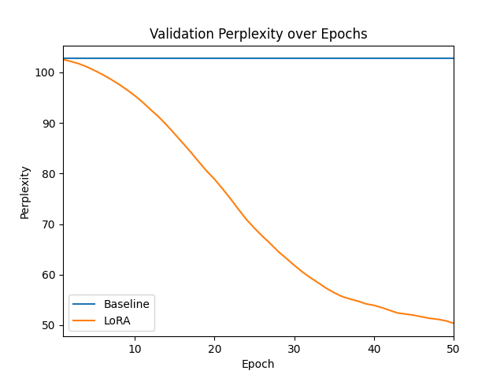

# 🔥 LoRA-GPT2: Personal Style Tuning with Micro-Corpus

This project explores how **Low-Rank Adaptation (LoRA)** can fine-tune a large language model (GPT-2) using a **tiny, personalized dataset** (100–200 lines). The goal: replicate someone's unique writing style using only minimal compute and data.

---

## 📌 Project Highlights

- ✅ Fine-tunes GPT‑2 on **your own style** (first-person reflective corpus)
- 🚀 Uses **LoRA** to inject trainable adapters (~150K parameters only)
- 🧠 Implements a **gradient-based adapter-ranking scheme** to select top-4 attention modules dynamically
- 📉 Achieves ~50% perplexity reduction over 50 epochs
- 💻 Runs comfortably on a **single GPU or CPU** in under 2 hours

---

## 🗂️ Files

- `lora_gpt2_tune.py`: Main training and evaluation script
- `micro_corpus.txt`: Sample dataset (replace with your own!)
- `lora_gpt2_results/ppl_curve.png`: Perplexity plot
- `requirements.txt`: Python package dependencies

---

## 📈 Results

- **Baseline GPT‑2 PPL**: ~102.7 
- **LoRA GPT‑2 PPL (50 epochs)**: ~50.4  
> ~51% perplexity drop using just ~0.12% of total model parameters



---

## 💡 Example Outputs

**Prompt**:  
`My thoughts drift to the pages of the notebook always at my side.`

| Baseline GPT‑2                                                        | LoRA-Tuned GPT‑2                                      |
|-----------------------------------------------------------------------|-------------------------------------------------------|
| …I think about how my own thoughts are only made up of my thoughts…   | …I'm thinking about how I should have gotten home…    |

LoRA-tuned generations better mirror the reflective tone and first-person phrasing of the custom micro-corpus.

---

## 📦 Dataset

**Name**: Custom Micro-Corpus  
**Format**: Plain text (`.txt`) — one sentence per line  
**Size**: ~100–200 lines  
**Style**: First-person reflective (e.g., journal-style or narrative prose)  

> You can replace `micro_corpus.txt` with your own writing samples to personalize GPT‑2 to your voice.

---

## ⚙️ Setup & Usage

```bash
git clone https://github.com/moody-taco/LoRA-GPT2-StyleTuning
cd LoRA-GPT2-StyleTuning
pip install -r requirements.txt
python lora_gpt2_tune.py
```

The script will:
- Evaluate GPT‑2 baseline performance
- Dynamically select top-4 modules using a one-batch gradient importance scheme
- Inject LoRA adapters into selected attention layers
- Train for 50 epochs
- Plot validation perplexity over time
- Generate output samples from both models

---

## 🧠 Credits

- **LoRA** by [Hu et al. (2021)](https://arxiv.org/abs/2106.09685)
- [Hugging Face Transformers](https://github.com/huggingface/transformers)
- [PEFT Library (Hugging Face)](https://github.com/huggingface/peft)
- [🤗 Datasets](https://github.com/huggingface/datasets)
- Adapter-ranking strategy inspired by gradient-based sensitivity
- Prompt engineering & design by Mudit Arukia


---

## 📄 License

This project is licensed under the MIT License. Feel free to use, adapt, and cite appropriately.

